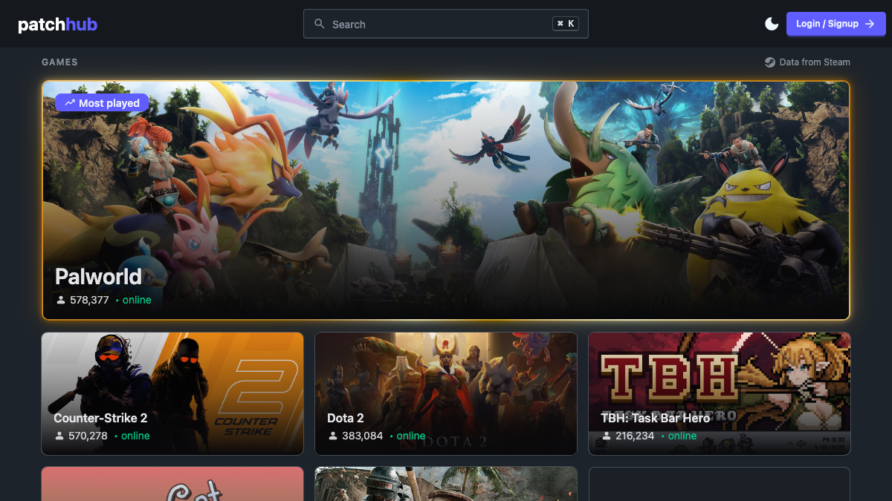
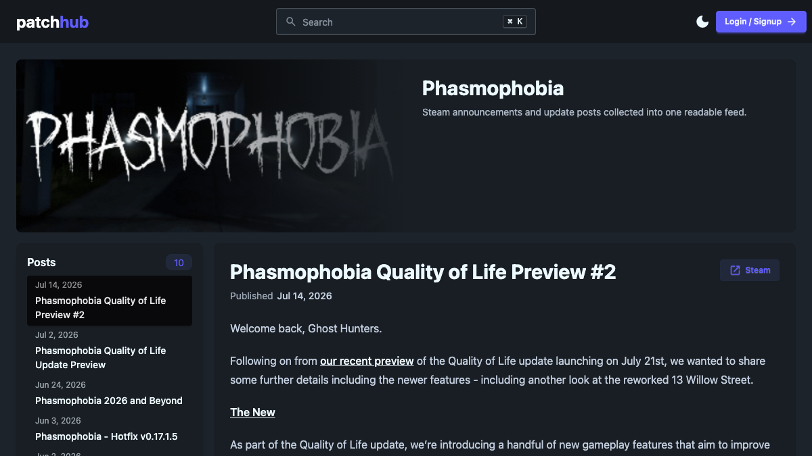

<p align="center">
  <a href="https://patchhub.io">
    
  </a>
</p>

<h1 align="center">PatchHub</h1>

<p align="center">
  <strong>One place for updates.</strong>
</p>

<p align="center">
  Follow patch notes for games and software, or publish updates for your own projects.
</p>

<p align="center">
  <a href="https://patchhub.io">Open PatchHub</a>
  ·
  <a href="https://github.com/mcullifer/PatchHub/issues">Report an issue</a>
</p>

<p align="center">
  
  
  
  
</p>

## Why I built it

Steam game updates are on Steam. Some games put their patch notes on their own sites. Phone apps,
of course, give you the incredibly useful "Bug fixes and performance improvements" every single
time. Software updates might have a proper changelog, or they might be hiding on some random page
you would never think to check. It's all over the place.

I started PatchHub in 2022 because I wanted one place where I could follow all of it without having
to remember where every game, app, or project decided to post updates.

## Where it is going

PatchHub currently gathers updates from external sources. That's what makes it useful now, while
there aren't many people posting their own updates here yet.

The real goal is for people and projects to publish their updates through PatchHub itself. If that
works, the external feeds can eventually go away because the updates will already be here.

## Preview

<p align="center">
  <a href="./.github/assets/patchhub-home.png">
    
  </a>
  <a href="./.github/assets/patchhub-game-feed.png">
    
  </a>
</p>

## What works today

- Browse updates from popular Steam games and software release feeds.
- Follow the games, software, and projects you care about.
- Create a project and publish patch notes directly on PatchHub.

## Run it locally

Requirements: Node.js 22.12 or newer.

```bash
git clone https://github.com/mcullifer/PatchHub.git
cd PatchHub
npm ci
cp .env.example .env
npm run dev
```

Fill in the values in `.env` before starting the app. Running `npx convex dev` connects a Convex
development deployment and writes `PUBLIC_CONVEX_URL` to `.env.local`.

## Useful commands

| Command                | Purpose                                                        |
| ---------------------- | -------------------------------------------------------------- |
| `npm run dev`          | Start the Vite development server                              |
| `npm run preview`      | Build and run the Cloudflare Worker locally                    |
| `npm run validate`     | Run Svelte, TypeScript, formatting, lint, and unit-test checks |
| `npm run check:worker` | Build and validate the Worker deployment                       |
| `npm run test:e2e`     | Run Playwright end-to-end tests                                |
| `npm run steam:sync`   | Synchronize the searchable Steam catalog                       |

PatchHub is open source and still in beta.
